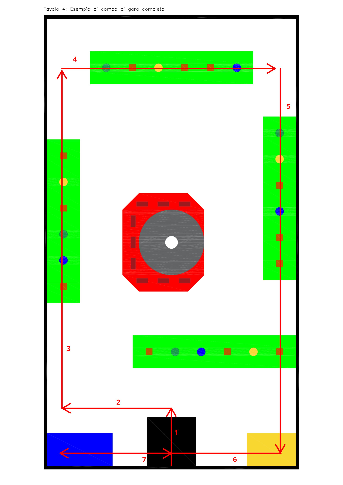

# GV Robot Pi

This repo is for the code of one robot that me and my team created for an afterschool project.

## Path
This is the path that the robot will go on

## Dependencies
- GPIO (preinstalled on Raspberry Pi OS)
- Pixy (You'll have to compile it, instructions on [pixy website](https://docs.pixycam.com/wiki/doku.php?id=wiki:v2:building_libpixyusb_as_a_python_module_on_linux))

## Hardware used
- Raspberry Pi 3B+
- A4988 (x2) Stepper motor driver
- HC-SR04 (x3) Ultrasonic distance sensor